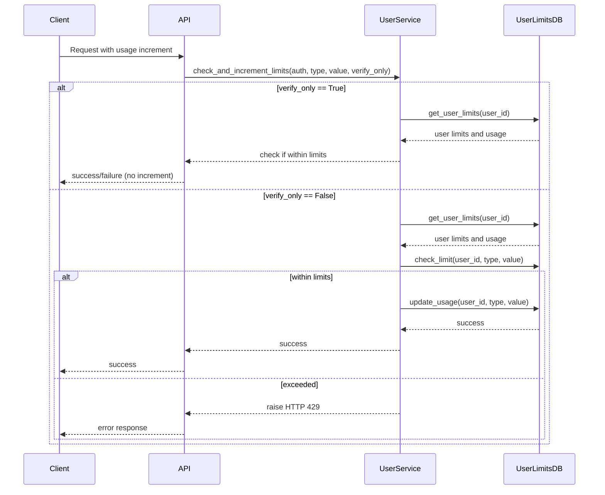

# Quotas & Rate Limits

Understanding your usage quotas and rate limits is crucial for efficient and uninterrupted use of Morphik's API services. This documentation outlines how quota enforcement varies by account tier, explains differences between dry-run (estimation) and live usage operations, details how to programmatically check your current quotas via the API, and offers strategies for gracefully handling quota limit rejections.

---

## 1. Quotas & Rate Limits Overview

Usage limits in Morphik serve to control resource consumption, ensuring fair access and system stability. These limits vary based on your account tier—**Free**, **Pro**, **Teams**, or **Self-Hosted**—with more generous allowances for paid plans.

### 1.1 Account Tiers and Their Limits
Morphik’s tier system defines limits on:
- Number of applications (apps) per user
- Storage (file count and total size in GB)
- Document ingestion (measured in pages)
- Query operations (hourly and monthly limits)
- Knowledge graph creation and queries
- Cache creation and queries
- Agent call limits

| Tier        | App Limit | Storage Files | Storage Size (GB) | Ingest Pages | Queries/hr | Queries/mo | Graphs | Cache Creation |
|-------------|-----------|---------------|-------------------|--------------|------------|------------|--------|----------------|
| Free        | 1         | 30            | 0.25              | 200          | 30         | 50         | 1      | 0              |
| Pro         | 5         | 1000          | 2                 | 1500         | 100        | 10,000     | 10     | 5              |
| Teams       | 100       | 500,000       | 10                | 1,000,000    | 500        | 50,000     | 50     | 20             |
| Self-Hosted | ∞         | ∞             | ∞                 | ∞            | ∞          | ∞          | ∞      | ∞              |

(Some additional agent call limits and cache query limits also apply; see the full tier definition in [Account Tier Limits](#account-tier-limits).)

### 1.2 What Gets Measured?
The primary quota metering categories are:
- **Queries:** API calls that execute searches, completions, and retrievals.
- **Ingestion:** Document content added to the system, measured in pages.
- **Storage:** Number and size of files stored.
- **Graphs:** Creation and query operations on knowledge graphs.
- **Caches:** Creation and query of caches.
- **Agent Calls:** Calls made to conversational AI agents.

### 1.3 Dry-run (Estimation) vs Live Usage
You can **estimate** whether an operation would exceed your limits **without** consuming quota using the `verify_only=True` mode in API calls that support it. This dry-run mode checks limits and will reject operations that would fail quota enforcement but **does not** update usage counters.

In contrast, live usage calls (`verify_only=False` or omitted) **both check and increment** your usage, instantly applying quota consumption.

---

## 2. Checking Your Current Quotas via the API

Morphik provides API-accessible endpoints to retrieve your current usage and limits per category, enabling application UI feedback or pre-flight checks.

### 2.1 Retrieving Limits and Usage
Use the User Limits API (via the Python SDK or direct REST calls) to fetch your current tier, limits, and usage counters.

Example (Python SDK):
```python
from morphik import Morphik

client = Morphik("morphik://<YOUR_APP_TOKEN>@api.morphik.ai")

user_limits = await client.get_user_limits()

print(f"Tier: {user_limits.tier}")
print(f"Usage: {user_limits.usage}")
print(f"Custom limits: {user_limits.custom_limits}")
```

Fields returned include:
- `tier` (account tier string)
- `usage` (counts such as `hourly_query_count`, `monthly_query_count`, `ingest_count`, etc.)
- `custom_limits` (if applicable)

These values help you understand remaining quota.

### 2.2 Use Tier Definitions to Interpret Limits
For the most accurate limits, consult the official tier limits defined in Morphik's system (see [Account Tier Limits](#account-tier-limits)) or retrieve these programmatically if your plan uses custom limits.

---

## 3. Quota Enforcement Behavior

### 3.1 How Limits Are Applied
- For **Free tier users**, strict quotas are enforced. Exceeding a quota will cause API requests to return HTTP 429 **Too Many Requests** errors with messages indicating the exceeded limit.
- For **paid tiers** (Pro, Teams), limits are generally more generous; usage is typically metered without operational blocking.
- For **Self-Hosted**, no limits are enforced.

### 3.2 Automatic Usage Tracking
Morphik automatically tracks usage for all invocations affecting queries, ingestion, storage, graphs, cache, and agent calls. This tracking includes periodic hourly and monthly resets where applicable.

### 3.3 Estimated Page Counting with ColPali
For document ingestion, Morphik supports ColPali integration to count pages/chunks more accurately rather than relying on character count heuristics. You can enable this to get precise ingest usage.

---

## 4. Handling Quota Rejections Gracefully

When the system rejects a request due to quota exhaustion, it returns HTTP 429 with a clear message. To maintain robust integrations, follow these guidelines:

### 4.1 Detect and Interpret 429 Responses
Ensure your client checks HTTP status codes and inspects the response body for quota details.

### 4.2 Implement Retry and Backoff Logic
Implement exponential backoff and retry strategies for transient limits such as hourly query limits.

### 4.3 Plan for Upgrades or Usage Reduction
If persistent rejections occur, evaluate upgrading your account tier or reducing usage frequency.

### 4.4 Use Dry-Run Checks Before Expensive Actions
Before sending large or high-volume operations, use the `verify_only` parameter to simulate quota allowance and avoid unnecessary failures.

Example: dry-run ingestion check
```python
try:
    await client.check_and_increment_limits(
        auth=client.auth_context,
        limit_type="ingest",
        value=estimated_pages,
        verify_only=True
    )
    # Proceed with actual ingest
except HTTPException as http_ex:
    if http_ex.status_code == 429:
        print("Quota exceeded - ingestion not allowed")
```

---

## 5. Account Tier Limits

These limits are the baseline reference for the Morphik hosted platform. Custom or enterprise plans may differ.

| Limit Category       | Free          | Pro            | Teams          | Self-Hosted     |
|---------------------|---------------|----------------|----------------|----------------|
| **Application Limit**| 1             | 5              | 100            | Unlimited      |
| **Storage Files**    | 30            | 1000           | 500,000        | Unlimited      |
| **Storage Size (GB)**| 0.25          | 2              | 10             | Unlimited      |
| **Ingest Pages**     | 200           | 1,500          | 1,000,000      | Unlimited      |
| **Hourly Query Limit** | 30          | 100            | 500            | Unlimited      |
| **Monthly Query Limit**| 50          | 10,000         | 50,000         | Unlimited      |
| **Graph Count Limit**| 1             | 10             | 50             | Unlimited      |
| **Cache Count Limit**| 0             | 5              | 20             | Unlimited      |
| **Agent Calls Hrly** | 3             | 30             | 100            | Unlimited      |

Full detailed limits exist also for graph queries, cache queries, and agent calls per month.

---

## 6. Practical Tips & Best Practices

- **Monitor your usage regularly:** Use the API to fetch current usage and plan actions before hitting limits.
- **Estimate usage before actions:** Use `verify_only=True` mode to check if an operation fits your quota.
- **Leverage paid tiers for scale:** Upgrade if you consistently hit free-tier limits.
- **Use ColPali integration:** For ingestion, ColPali's page counting is more precise.
- **Plan batch operations carefully:** Large batch ingestions can quickly consume ingest quota; break into stages if needed.
- **Handle 429 errors explicitly:** Implement clear error handling and user messaging.

---

## 7. API Reference: Usage Limits Checking

### 7.1 Function: `check_and_increment_limits`
Checks if usage fits within your limits, optionally records usage.

| Parameter          | Description                                                 |
|--------------------|-------------------------------------------------------------|
| `auth`             | Authentication context (user info)                          |
| `limit_type`       | Usage category (`query`, `ingest`, `storage_file`, etc.)   |
| `value`            | Amount of usage to add/check (integer)                      |
| `document_id`      | Optional, used for subscription metering                    |
| `verify_only`      | If true, only checks limits, does not record usage          |
| `use_colpali`      | For ingestion, whether to use ColPali accurate page counts  |
| `colpali_chunks_count` | Number of ColPali chunks when applicable                  |

Raises HTTP 429 error if limits exceeded:

```python
await check_and_increment_limits(
    auth=auth_context,
    limit_type="ingest",
    value=estimated_pages,
    verify_only=True  # Dry-run mode
)
```

### 7.2 Usage
The function handles details of free-tier strict enforcement versus paid-tier metering, ensuring you only pay attention to limits if your tier requires it.

---

## 8. Troubleshooting Common Quota Issues

<AccordionGroup title="Common Quota Issues and Solutions">
<Accordion title="Unexpected 429 Errors on Query Operations">
Double-check your current query usage via the API. Queries accumulate hourly and monthly counts.

Consider reducing query frequency or upgrading your account.

Ensure you are not sending requests with `verify_only=True` inadvertently.
</Accordion>
<Accordion title="Document Ingestion Denied Due to Limit">
Verify the estimated number of pages you are ingesting. For text, use `estimate_pages_by_chars` with character count.

If using ColPali, confirm chunk counts are accurate.

Try splitting large documents into smaller files.
</Accordion>
<Accordion title="Storage Limits Hit Despite Deleting Files">
Check that deletions are completing and usage statistics update accordingly.

Some delays in usage counters may occur; wait a few minutes before retrying.
</Accordion>
<Accordion title="App Limit Prevents Generating New API Tokens">
Free tier users can only create 1 app.

Delete unused apps or upgrade to Pro for more apps.
</Accordion>
</AccordionGroup>

---

## 9. Related Resources

- [Account Tiers & Limits](https://docs.morphik.ai/overview/architecture-core-concepts/core-concepts#account-tiers)
- [Using the Morphik Console for Usage Monitoring](https://docs.morphik.ai/overview/feature-overview/console-sdk-api)
- [Python SDK Examples for Usage & Authentication](https://docs.morphik.ai/api-reference/api-authentication-requests/sdk-examples)
- [Error Handling & Status Codes](https://docs.morphik.ai/api-reference/api-operations-limits/error-handling)
- [Ingesting Documents Guide](https://docs.morphik.ai/guides/core-workflows/ingest-documents)

---

## 10. Summary Diagram: Flow of Quota Check & Record



---

## Appendix: Usage Calculation Heuristic

Morphik estimates pages for ingest usage using:

- Average 4 characters per token
- Approx. 630 tokens per "page"

Use `estimate_pages_by_chars(char_len)` to convert character length into pages (minimum 1 page charged).

Example:

```python
from core.limits_utils import estimate_pages_by_chars
char_length = len(document_text)
pages = estimate_pages_by_chars(char_length)
print(f"Estimated pages: {pages}")
```

This helps you estimate your ingest quota impact before uploading.

---

**End of Quotas & Rate Limits Documentation**
