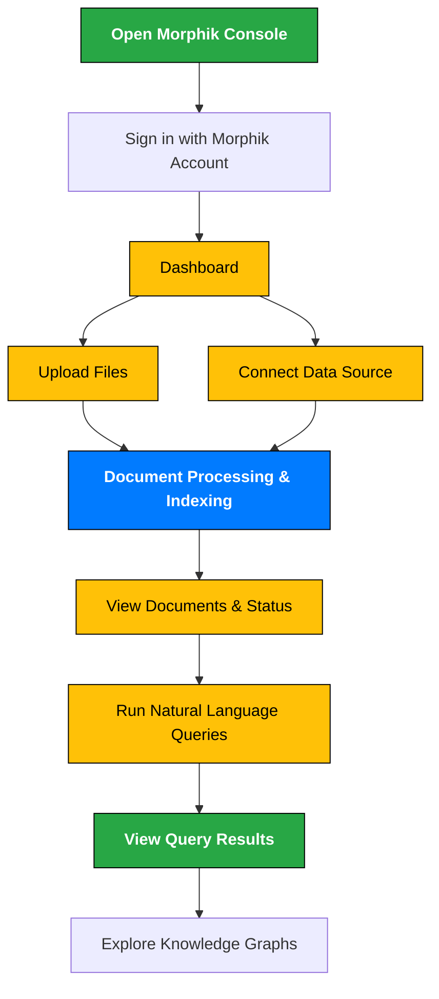

# Getting Started with Morphik Console

Welcome to the Morphik Console—the intuitive web interface designed for users who want to interact with Morphik without writing any code. This guide walks you through your first steps: uploading files, connecting external data sources, and running your first queries interactively.

---

## Why Use the Morphik Console?

The Console offers a user-friendly way to:

- **Ingest your documents** quickly by drag-and-drop or folder upload.
- **Connect external data sources** such as cloud storage or databases.
- **Search and query** your data using natural language without any programming.
- **Visualize knowledge graphs** built from your documents.

Whether you’re an author, analyst, researcher, or team member, the Morphik Console gives you powerful AI-assisted insights at your fingertips.

---

## Quick Start Checklist

Before you dive in, ensure you have:

- A Morphik account (or access to a self-hosted Morphik instance).
- Your Morphik URI token (found in your account dashboard).
- Your documents ready for upload (PDFs, images, text files, etc.).

Then follow these quick steps:

1. Log in to the Morphik Console at [https://console.morphik.ai](https://console.morphik.ai).
2. Upload your documents or connect your data source.
3. Wait for indexing and processing to complete.
4. Enter a natural language query to explore your data.
5. View answers, source documents, and knowledge graph visualizations.

---

## Walkthrough: Using the Morphik Console

### 1. Accessing the Console

Open your web browser and go to [https://console.morphik.ai](https://console.morphik.ai). Sign in using your Morphik credentials.

### 2. Uploading Files

- From the Dashboard, click **Upload Files**.
- Drag and drop documents or browse to select files from your computer.
- Supported formats include PDFs, images, Microsoft Office documents, text files, and more.
- Add optional metadata tags or categories to organize content.
- Click **Start Upload** to begin ingestion.

### 3. Connecting External Data Sources

- Select **Connect Data Source** from the sidebar.
- Choose from supported sources like Google Drive, Dropbox, or S3 buckets.
- Authenticate and grant permissions as prompted.
- Configure folder or file filters to control what data is ingested.
- Confirm to start syncing and indexing your connected content.

### 4. Monitoring Processing Status

- After uploading or connecting data, navigate to the **Documents** tab.
- Each document displays its ingestion status: **Processing**, **Completed**, or **Failed**.
- You can click a document to view detailed metadata, content previews, and extracted elements.
- Use the refresh button to update statuses as processing completes.

### 5. Running Your First Query

- Go to the **Query** tab.
- Type your question in natural language, e.g., “What are the key features of the latest product manual?”
- Apply filters or select specific folders/users if you want to narrow the scope.
- Click **Search** or hit Enter.
- The Console returns relevant passages, answers, and documents.
- Click on any result to view the source context.

### 6. Exploring Knowledge Graphs

- If you have created or the system has generated knowledge graphs,
  access them under the **Knowledge Graphs** tab.
- Visualize entity relationships and connections extracted from your documents.
- Click graph nodes to explore underlying documents and facts.

---

## Best Practices & Tips

- **Organize your content**: upload documents with meaningful filenames and tags for easier filtering.
- **Leverage folders and user scopes** if collaborating with teams to separate datasets.
- **Use metadata filters** when querying to focus results on relevant subsets.
- **Check ingestion status** regularly to ensure all documents are processed before querying.
- **Preview extracted entities and images** from documents to verify ingestion quality.

---

## Common Pitfalls & Troubleshooting

### I don’t see my documents after upload.
- Wait a few moments; ingestion and processing can take time.
- Refresh the Documents tab.
- Verify that your file format is supported.
- If issues persist, check your network connection or contact support.

### Queries return no or irrelevant results.
- Make sure documents are fully processed.
- Broaden or adjust your search query.
- Remove or revise metadata filters.
- Ingest more representative content relevant to the query topic.

### Unable to connect external data sources.
- Double-check authentication credentials.
- Ensure you have granted necessary permissions.
- Confirm source API or service availability.

---

## Next Steps

Once comfortable with the Console, consider:

- Creating **folders** and **user scopes** to organize and secure data.
- Exploring advanced **knowledge graph creation and queries**.
- Using the **Python SDK** or **REST API** for programmatic ingestion and searching.
- Reviewing the [Quick Start guide](https://morphik.ai/docs/overview/feature-overview/quickstart) to build familiarity.

Need more help? Visit the [Getting Help & Support](https://morphik.ai/docs/getting-started/troubleshooting-help/getting-community-support) page or join our community on Discord.

---

## Summary Diagram: Morphik Console User Flow

---

# Additional Resources

- [Morphik Console User Guide](https://morphik.ai/docs/morphik-console)
- [Python SDK Introduction](https://morphik.ai/docs/sdks/python/README.md)
- [Quick Start: Using Morphik](https://morphik.ai/docs/overview/feature-overview/quickstart)
- [Knowledge Graphs Guide](https://morphik.ai/docs/guides/knowledge-graphs/build-knowledge-graph)
- [Troubleshooting Installation Problems](https://morphik.ai/docs/getting-started/troubleshooting-help/common-install-issues)

---

Enjoy unlocking the power of your data with Morphik Console. Your journey to smarter, context-rich AI applications starts here!