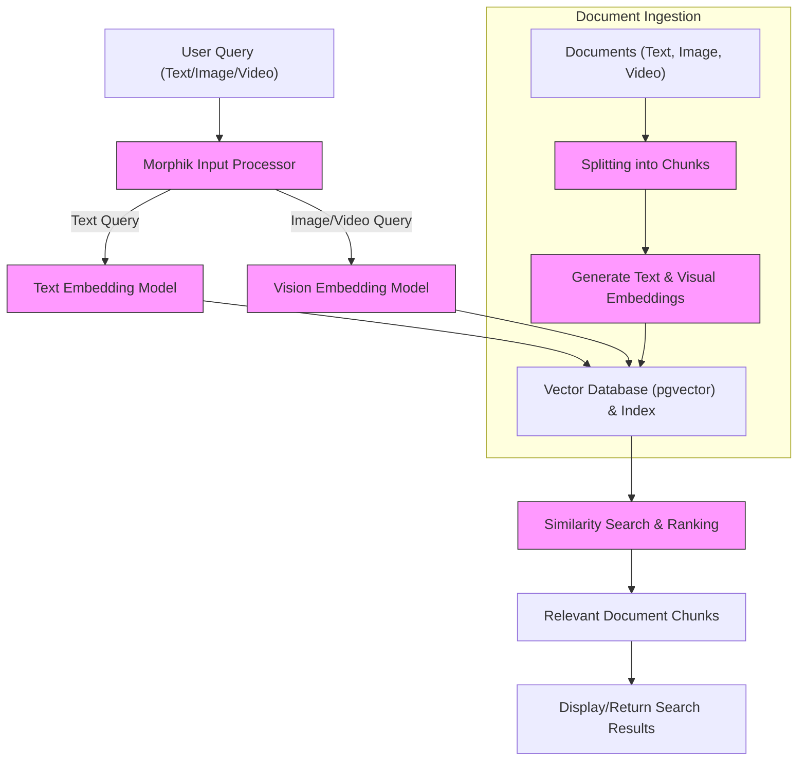

# Multimodal Search & Retrieval

Unlock powerful search capabilities across text, images, and videos contained within your documents using Morphik’s multimodal search features. This guide demonstrates how to query your indexed data via Morphik’s Python SDK and Console, using natural language, image, and video inputs.

---

## Workflow Overview

### What You Will Achieve
This guide helps you perform advanced multimodal searches that span text, images, and videos within your indexed documents. By the end, you will know how to construct queries using Morphik’s SDK and Console to retrieve the most relevant content fragments regardless of their format.

### Prerequisites
- You have already ingested documents with multimodal content (text, images, videos) into Morphik.
- Morphik Python SDK is installed and authenticated, or you have access to the Morphik Console.
- Your documents have been processed and indexed with embeddings supporting multiple modalities.

### Expected Outcome
You will be able to:
- Execute natural language queries to search text and visual content.
- Use image or video samples to perform similarity-based retrieval.
- Filter and scope searches with metadata and folder constraints.
- Interpret and handle multimodal search results effectively.

### Time Estimate
Approximately 15-30 minutes depending on prior setup and experience.

### Difficulty Level
Intermediate. Familiarity with the Morphik CLI, SDK, or Web Console and basic Python programming will be helpful.

---

## How Multimodal Search Works

Morphik combines powerful embeddings and vector similarity search to understand and match queries across multiple data types:
- **Text queries** use advanced language models for semantic search.
- **Images and videos** are converted into vector embeddings capturing visual features.
- All vectors are stored in a vector database optimized for fast similarity computation.

This unified approach allows Morphik to retrieve content fragments (chunks) that best match your query regardless of the mode of input.

---

## Step-by-Step Instructions

<Steps>
<Step title="Performing a Multimodal Search using the Python SDK">
Follow these steps to query your indexed multimodal documents programmatically.

1. **Initialize the Morphik Client**

   ```python
   from morphik import Morphik

   morphik = Morphik(api_key="YOUR_API_KEY", api_url="https://api.morphik.ai")
   ```

2. **Formulate Your Query**

   You can search using text or provide an image/video as the query. For example, a natural language question:

   ```python
   query_text = "Find diagrams explaining vector databases"
   ```

3. **Run the Search**

   Call the search method specifying the query and number of results to return:

   ```python
   results = morphik.search(query=query_text, k=5)

   for chunk in results:
       print(f"Document: {chunk.document_id}")
       print(f"Content snippet: {chunk.content[:200]}...")
       print(f"Relevance Score: {chunk.score:.2f}")
       print('-' * 40)
   ```

4. **Using Image or Video Queries**

   To perform image or video queries, pass the base64-encoded or local file content to the SDK query interface similarly:

   ```python
   with open("query_image.png", "rb") as image_file:
       image_data = image_file.read()
   
   results = morphik.search(query=image_data, k=3)  # SDK detects multimodal input
   ```

5. **Apply Metadata or Folder Filtering**

   Scope queries to specific folders or metadata for refined search:

   ```python
   results = morphik.search(query=query_text, k=5, filters={"author": "Jane Doe"}, folder_name="ProjectDocs")
   ```

**Outcome:** You will see a ranked list of relevant document chunks containing textual, image, or video content matching your query.
</Step>

<Step title="Using the Morphik Console for Multimodal Search">
The Morphik Console offers a user-friendly interface to run rich multimodal queries without programming.

1. **Access the Console:** Log in at https://console.morphik.ai

2. **Navigate to Search:** Select the Search or Query tab.

3. **Enter Your Natural Language Query:** Use plain English to ask questions or describe what you want to find.

4. **Upload an Image or Video for Querying:** Drag or upload a sample visual file to search by similarity.

5. **Refine Your Search:** Use the UI filters to select folders, tags, or adjust the number of results.

6. **View Results:** Examine returned chunks, which include text snippets, images, or video frame thumbnails with relevance scores.

7. **Interact with Results:** Click results to open the full document view or explore the underlying metadata.

**Outcome:** Instantly get multimodal search results in an interactive, graphical environment suitable for exploratory search.
</Step>
</Steps>

---

## Practical Examples

### Example 1: Textual Query for Image-Rich Documents

```python
results = morphik.search(query="Explain vector databases with images", k=5)
for chunk in results:
    print(f"[{chunk.document_id}] Score: {chunk.score:.3f}")
    print(chunk.content[:150])
```

### Example 2: Image Query Using Base64 Sample

```python
import base64

with open("diagram_sample.png", "rb") as f:
    img_base64 = base64.b64encode(f.read()).decode('utf-8')

results = morphik.search(query=img_base64, k=3)
for chunk in results:
    print(f"Doc: {chunk.document_id}, Score: {chunk.score:.3f}")
```

### Example 3: Scoped Search in a Folder

```python
results = morphik.search(query="timeseries analysis", k=10, folder_name="ResearchReports")
print(f"Found {len(results)} matches in ResearchReports folder")
```

---

## Tips & Best Practices

- **Accurate Embeddings Drive Results:** Ensure your documents are properly ingested with multimodal embeddings enabled for the best search quality.
- **Use Filters to Narrow Scope:** When working with large datasets, filters such as folder names, authors, dates, or tags help focus results.
- **Mix Modalities:** Combine text and image queries to cover different angles of information retrieval.
- **Optimize Chunk Size:** Smaller chunks improve granularity but may increase result volume; adjust the chunking during ingestion accordingly.

### Common Pitfalls

- **Query Format Matters:** Provide clear input — text queries for text, properly encoded images/videos for multimedia.
- **Delayed Updates:** Indexing can take time; wait for ingestion completion before querying newly uploaded data.
- **Large Video Files:** Videos may require frame extraction before indexing; check ingestion best practices for video.

---

## Troubleshooting

<AccordionGroup title="Common Issues in Multimodal Search">
<Accordion title="No Results Returned for Multimodal Queries">
- Verify your documents contain indexed embeddings for the modalities involved.
- Check if ingestion has fully completed.
- Confirm your query format matches the data type (e.g., base64 encoding for images).
</Accordion>
<Accordion title="Search is Slow or Timing Out">
- Large datasets may slow vector searches; consider reducing `k` the number of results.
- Ensure database connection and vector search indices are properly configured.
- Review your Morphik service logs for any errors during query execution.
</Accordion>
<Accordion title="Image/Video Queries Not Working as Expected">
- Confirm that your server or SDK supports visual input embedding as configured.
- Validate the format and encoding of multimedia inputs.
- For videos, ensure frame extraction and captioning features are enabled if required.
</Accordion>
</AccordionGroup>

---

## Next Steps & Related Content

- Learn how to [Ingest Documents of All Types](https://docs.morphik.ai/guides/core-workflows/ingest-documents) to maximize multimodal data capture.
- Explore building and querying Knowledge Graphs from your multimodal data for deeper insights.
- Review [Morphik Console Usage](https://docs.morphik.ai/getting-started/first-steps-and-validation/using-the-morphik-console) for interactive multimodal search.
- Dive into SDK advanced usage and error handling to optimize your integration.

---

## References

- Morphik Python SDK: [GitHub repo](https://github.com/morphik-org/morphik-core)
- Morphik Configuration: `morphik.toml` settings for embeddings and multimodal capabilities
- Sample embedding models include `ollama_qwen_vision` and `colpali` for vision-text fusion

---

For any issues not covered here, consult the [Troubleshooting Installation Problems](https://docs.morphik.ai/getting-started/troubleshooting-help/common-install-issues) guide or reach out to the Morphik community.

---

# Visual Overview



This diagram illustrates how a multimodal query passes through processing, embeddings are generated according to the input type, vectors are searched in the vector database, and relevant chunks are returned to the user.
