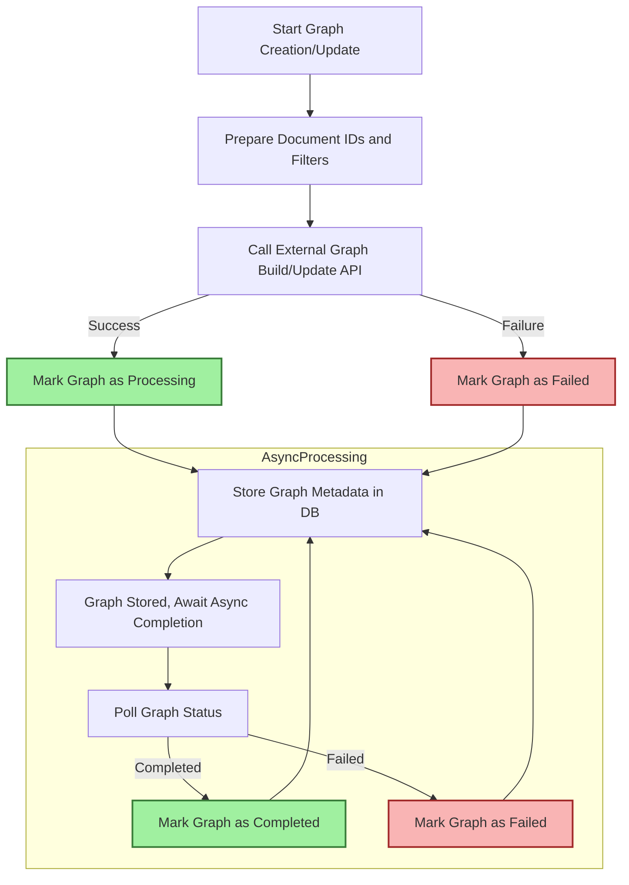

# Advanced: Customizing Graph Extraction and Prompts

Unlock the full power of Morphik's knowledge graph generation through advanced prompt engineering and workflow customization. This guide walks you step-by-step through the process of tailoring entity extraction, relationship identification, and update workflows using prompt overrides and intelligent configuration.

---

## Workflow Overview

### What You'll Achieve

You will learn how to control and optimize knowledge graph construction in Morphik by using custom prompt overrides and configuring graph build/update workflows. This enables you to extract domain-specific entities and relationships with higher accuracy, tune workflow orchestration for your specific datasets, and effectively monitor graph processing.

### Prerequisites

- Basic familiarity with Morphik knowledge graph concepts.
- Access to a Morphik environment with document ingestion capability.
- Morphik Python SDK or equivalent client setup.
- Basic understanding of prompt engineering.

### Expected Outcome

- Create knowledge graphs infused with domain-aware entity and relationship extraction rules.
- Utilize prompt overrides to customize extraction examples and instructions.
- Perform asynchronous graph builds with status tracking.
- Update graphs with new documents and filters, managing workflow lifecycle.

### Time Estimate

Approximately 20-40 minutes depending on domain complexity and dataset size.

### Difficulty Level

Intermediate to Advanced

---

## Step-by-Step Guide

### 1. Prepare Your Domain-Specific Entity Extraction Prompts

Morphik allows overriding the default entity extraction prompt with granular control. To begin:

- Define **entity examples** representing the key types relevant to your knowledge graph (e.g., Dataset, Method, Task).
- Write a detailed prompt template instructing the extraction and relationship detection tasks.
- Use the `EntityExtractionPromptOverride` model to package your prompt and examples.

#### Sample prompt template snippet

```python
from morphik.models import EntityExtractionPromptOverride, EntityExtractionExample

examples = [
    EntityExtractionExample(label="ImageNet", type="Dataset"),
    EntityExtractionExample(label="BERT", type="Method"),
    EntityExtractionExample(label="Image Classification", type="Task"),
    # Add your domain-specific examples here
]

prompt_template = """
Your task is to carefully read the scientific text and extract:
1. Entities like Datasets, Methods, and Tasks.
2. Relationships explicitly mentioned in the text between these entities,
following specified types such as Used-For and Feature-Of.

Examples:
{examples}

Text to analyze:
{content}
"""

entity_extraction_override = EntityExtractionPromptOverride(
    prompt_template=prompt_template,
    examples=examples
)
```

### 2. Wrap Prompt Overrides for Graph Creation

Bundle your prompt overrides into `GraphPromptOverrides` to direct both entity extraction and resolution during graph generation.

```python
from morphik.models import GraphPromptOverrides

graph_overrides = GraphPromptOverrides(entity_extraction=entity_extraction_override)
```

### 3. Ingest Your Data and Create a Graph

- Ingest your documents normally using Morphik's ingestion methods (text or files).
- Create a graph by specifying the graph name, document filters or specific documents, and passing your prompt overrides.

```python
# Assuming 'db' is an instance of Morphik client

doc_ids = [doc1_id, doc2_id, doc3_id]  # IDs of ingested documents

graph = await db.create_graph(
    name="custom_domain_graph",
    documents=doc_ids,
    prompt_overrides=graph_overrides
)

print(f"Graph '{graph.name}' created with {len(graph.entities)} entities.")
```

### 4. Monitor Graph Build Progress

Graph creation is asynchronous:

- Use the graph status endpoint to poll for completion.
- Watch for `status` fields such as `processing`, `completed`, or `failed`.

```python
status = await db.get_graph_status("custom_domain_graph")
print(f"Graph status: {status['status']}")
# Repeat or wait using asyncio until status is completed
```

### 5. Update Existing Graphs with New Data

To expand an existing graph with new documents or filters:

- Use the `update_graph` method with additional documents or filters.
- The update is also asynchronous and supports prompt overrides.

```python
updated_graph = await db.update_graph(
    name="custom_domain_graph",
    additional_documents=["doc4", "doc5"],
    additional_filters={"category": "updates"},
    prompt_overrides=graph_overrides
)

print(f"Updated graph '{updated_graph.name}' now has {len(updated_graph.entities)} entities.")
```

### 6. Customize and Troubleshoot

- Ensure your prompt template avoids over-generalization; be specific and unambiguous.
- Include diverse examples to cover edge cases in your domain.
- Use the graph status API to detect errors and troubleshoot promptly.
- Monitor logs if available for detailed error diagnosis.

<Tip>
For best accuracy, iteratively refine prompt overrides based on initial graph results. Use small test datasets before scaling up.
</Tip>

---

## Examples

### Example: SciER Dataset Graph with Prompt Overrides

This snippet shows how to create prompt overrides tailored for scientific literature entity types:

```python
from morphik.models import EntityExtractionExample, EntityExtractionPromptOverride, GraphPromptOverrides

examples = [
    EntityExtractionExample(label="ImageNet", type="Dataset"),
    EntityExtractionExample(label="BERT", type="Method"),
    EntityExtractionExample(label="Image Classification", type="Task"),
]

prompt_template = """
Your task is to extract entities and relationships from scientific text.
Entities: Dataset, Method, Task.
Relationships: Used-For, Feature-Of, Part-Of, etc.

Examples:
{examples}

Text:
{content}
"""

entity_extraction_override = EntityExtractionPromptOverride(
    prompt_template=prompt_template,
    examples=examples
)

graph_overrides = GraphPromptOverrides(entity_extraction=entity_extraction_override)

# Then create graph...
graph = await db.create_graph(
    name="scier_graph",
    documents=scier_doc_ids,
    prompt_overrides=graph_overrides
)
```

---

## Troubleshooting & Tips

### Common Issues

- **Graph creation hangs or never completes:** Verify network connectivity with external graph API; confirm document access permissions; check logs for API errors.
- **No entities extracted or poor quality:** Improve prompt clarity and expand domain-specific examples.
- **Prompt override validation errors:** Make sure your prompt overrides conform to Morphik's schema and validated via `validate_prompt_overrides_with_http_exception`.
- **Update failures:** Ensure new documents exist and are accessible; check that filters are well-formed JSON objects.

### Best Practices

- Use **asynchronous polling** to keep UI responsive while graphs build.
- Regularly **update your prompt overrides** based on domain evolution.
- Combine **filters and explicit document lists** to control graph scope precisely.
- Leverage **metadata filters** like folder name or end-user ID for multitenancy.

### Performance Considerations

- Large document sets may require longer graph build times;
- Utilize caching and incremental graph updates.
- Avoid overly broad filters to reduce processing overhead.

### Alternative Approaches

- For fully synchronous workflows, consider using smaller datasets or local models.
- Use graph visualization APIs to inspect and verify graph construction in detail.

---

## Next Steps & Related Content

- Learn how to [Build a Knowledge Graph from Documents](/guides/knowledge-graphs/build-knowledge-graph) with more on ingestion and extraction.
- Explore querying and visualization in [Querying and Visualizing Knowledge Graphs](/guides/knowledge-graphs/query-graph).
- Discover how to integrate prompt customization into chat workflows in [Conversational AI: Chatting with Your Documents](/guides/core-workflows/chat-with-your-data).
- See hands-on usage examples in the Morphik [Python SDK Documentation](/sdks/core-workflows/knowledge-graphs).

---

## Reference Diagram: Graph Creation & Update Flow



---