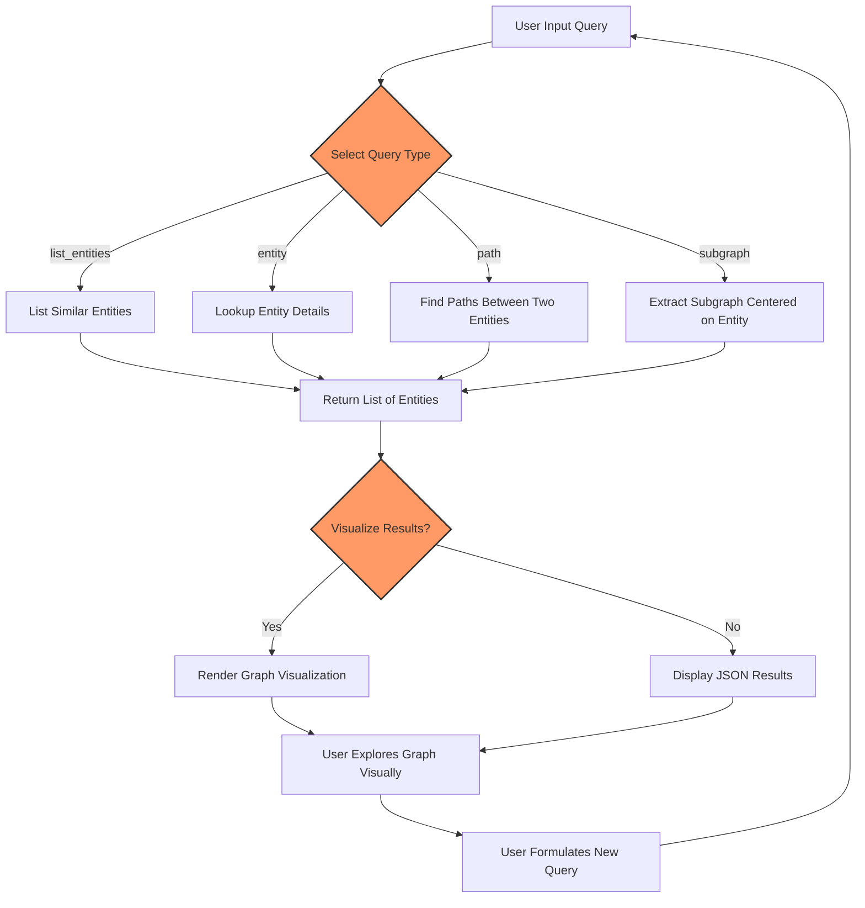

# Querying and Visualizing Knowledge Graphs

Explore the power of Morphik's knowledge graphs by formulating expressive queries to extract rich insights and by visualizing connections through intuitive graph views. This guide walks you through using built-in query tools to locate entities, explore relationships and paths, and leverage the Morphik Console’s graph visualization features for interactive exploration.

---

## 1. Understanding Knowledge Graph Queries

Morphik’s knowledge graph tooling empowers you to navigate and analyze the semantic relationships encoded across your ingested content. Instead of isolated text search, graph queries enable discovery of connected information, uncovering hidden patterns and connections.

### Query Types Supported:
- **List Entities:** Find entities semantically similar to a search term.
- **Entity Lookup:** Retrieve detailed information about a specific entity by ID or label.
- **Path Discovery:** Find all relationship paths connecting two entities, revealing how they relate.
- **Subgraph Extraction:** Get the local neighborhood of entities connected to a focus node.


<Tip>
For best results, start with a **list_entities** query to identify exact entity identifiers before exploring paths or subgraphs.
</Tip>

### Key Parameters for Queries:
- **start_nodes:** Entity IDs or names to focus the query.
- **max_depth:** Controls how far the graph is traversed (default is 3 hops).
- **graph_name:** Specify which graph to query; defaults to "graph_main" or your single available graph.

---

## 2. How to Perform Knowledge Graph Queries

You can interact with knowledge graphs via the Morphik Console UI or programmatically using the Python SDK's graph query capabilities. Below are actionable instructions for both.

### 2.1 Using Morphik Console Graph Query Tool

1. **Navigate to the Graphs Section:**
   - Access the Morphik Console and select the `Graphs` tab.

2. **Select or Create a Graph:**
   - Use an existing graph like `graph_main` or create your own filtered graph.

3. **Choose Query Type:**
   - Select one of: `list_entities`, `entity`, `path`, or `subgraph`.

4. **Enter Query Input:**
   - For `list_entities`, provide a search term.
   - For `entity` or `subgraph`, input a single entity ID or label.
   - For `path`, input two entity IDs or labels separated appropriately.

5. **Set Maximum Depth:**
   - Adjust hop depth (default 3) to control traversal scope.

6. **Execute Query:**
   - Run the query and review formatted JSON results, including entity details or paths found.

7. **Visualize Results:**
   - Use the graph view button to see visual representations of entities and relationships.

### 2.2 Using Python SDK for Knowledge Graph Queries

The following example demonstrates querying entities and paths using the async SDK client.

```python
import asyncio
from morphik import AsyncMorphik

async def run_graph_queries():
    async with AsyncMorphik("morphik://<owner>:<token>@api.morphik.ai") as db:
        # List entities similar to 'machine learning'
        list_entities_result = await db._client.graph_service.knowledge_graph_query(
            query_type="list_entities",
            start_nodes=["machine learning"],
            max_depth=3,
        )
        print("List Entities Result:", list_entities_result)

        # Entity lookup by label
        entity_result = await db._client.graph_service.knowledge_graph_query(
            query_type="entity",
            start_nodes=["Machine Learning"]
        )
        print("Entity Result:", entity_result)

        # Path discovery between two entities
        path_result = await db._client.graph_service.knowledge_graph_query(
            query_type="path",
            start_nodes=["Artificial Intelligence", "Healthcare"],
            max_depth=2
        )
        print("Path Result:", path_result)

asyncio.run(run_graph_queries())
```

<Tip>
When using the SDK, you can omit `graph_name` to let Morphik select the default graph. To query custom graphs, specify the `graph_name` argument.
</Tip>

---

## 3. Visualizing Knowledge Graphs

Visualization brings knowledge graphs to life, letting you see entities as nodes and relationships as edges, enabling interactive exploration and discovery.

### Accessing Graph Visualizations in the Morphik Console

1. **Open the Graphs Tab:**
   - Pick your target graph from the list.

2. **View Graph Visualization:**
   - Click the `View Graph` button or equivalent graph icon.

3. **Explore the Graph:**
   - Zoom, pan, and click nodes to see entity details.
   - Hover over edges to view relationship types.

4. **Filter and Customize:**
   - Apply metadata filters or adjust visualization parameters if supported.

<Tip>
Large graphs may take longer to render. For performance, consider filtering the graph to specific domains or entity types before visualization.
</Tip>

### Visualizing Graphs via Python SDK

You can fetch graph visualization data programmatically and use external libraries (e.g., NetworkX, Plotly) to render it.

```python
import asyncio
from morphik import AsyncMorphik

async def visualize_graph():
    async with AsyncMorphik("morphik://<owner>:<token>@api.morphik.ai") as db:
        data = await db.get_graph_visualization(name="graph_main")
        print("Nodes:", data["nodes"])
        print("Links:", data["links"])
        # Use your preferred graph library to render nodes and links

asyncio.run(visualize_graph())
```

---

## 4. Practical Tips and Best Practices

- **Start Simple:** Begin with listing entities to identify node IDs before running complex path or subgraph queries.
- **Limit Depth:** Use `max_depth` judiciously; higher values increase processing time and result complexity.
- **Scoped Queries:** Use graph names or scopes (folders, end-user IDs) to narrow results to relevant datasets.
- **Combined Queries:** Use graph-augmented queries along with document retrieval for richer context.
- **Use Prompt Overrides:** For advanced needs, customize entity extraction and resolution prompts to improve graph accuracy.

---

## 5. Common Issues and Troubleshooting

<AccordionGroup title="Troubleshooting Knowledge Graph Queries">
<Accordion title="Why am I getting 'No graphs found'?">
First, ensure you have created at least one knowledge graph and that your user context includes access permissions. Use the `list_graphs` tool to check available graphs.
</Accordion>
<Accordion title="My entity is not found in the graph query results">
Ensure you are using the correct entity ID or exact label. Running a `list_entities` query with a similar term can help find the correct entity identifier.
</Accordion>
<Accordion title="Graph visualization is slow or empty">
For large graphs, visualization can be slow. Try filtering the graph by metadata or focusing on subgraphs to reduce size.
</Accordion>
<Accordion title="Errors during graph creation or update">
Check system logs for API call failures. Ensure documents included in the graph have completed processing and that authentication is correct.
</Accordion>
</AccordionGroup>

---

## 6. Related Tools and Next Steps

- **Building Knowledge Graphs:** Learn how to create and update graphs from document collections. ([Building a Knowledge Graph guide](https://docs.morphik.ai/guides/knowledge-graphs/build-knowledge-graph))
- **Querying with Prompt Overrides:** Customize prompts to tailor extraction and resolution phases. ([Advanced Graph Operations](https://docs.morphik.ai/guides/knowledge-graphs/advanced-graph-operations))
- **Combining Graph and Document Queries:** Use knowledge graphs alongside multimodal retrieval for comprehensive answers.
- **Exploring Morphik Console:** Master the web UI for ingestion, search, and graph visualization.

---

## 7. Additional Resources

- [Morphik Console and SDK Overview](https://docs.morphik.ai/overview/feature-overview/console-sdk-api)
- [Knowledge Graph API Reference](https://docs.morphik.ai/api-reference/api-endpoints/knowledge-graphs-api)
- [Python SDK Usage Examples](https://docs.morphik.ai/sdks/core-workflows/knowledge-graphs)

---

### Diagram: Knowledge Graph Query Flow



---

Thank you for exploring Morphik’s knowledge graph capabilities. Leverage this guide to uncover powerful, connected insights from your data.
