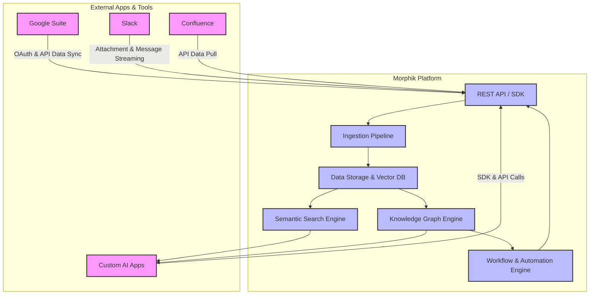

# Integration Landscape

Discover how Morphik seamlessly connects with your existing digital ecosystem and AI infrastructure. This page details Morphik’s versatile integration points—from popular productivity tools like Google Suite, Slack, and Confluence, to customizable access via REST API and the Python SDK—empowering you to embed intelligent document analytics and workflow automation directly into your applications.

---

## Unlocking Seamless Connectivity Across Platforms

Morphik is designed not just as a standalone AI document analytics tool, but as a flexible component in your broader technology stack. Whether your goal is to aggregate insights from corporate documents, automate workflows across apps, or build bespoke AI solutions, Morphik integrates effortlessly with the tools and systems you rely on.

### Key Integration Highlights

- **Plug into Popular SaaS Platforms:** Connect Morphik with Google Suite, Slack, and Confluence to ingest, enrich, and surface insights from documents and conversations already flowing through these channels.
- **Flexible API Access:** Use Morphik’s REST API or Python SDK to embed advanced document search, knowledge graph queries, and metadata extraction within your custom workflows and applications.
- **Modular Components:** Leverage individual Morphik services—like the semantic search engine or graph engine—independently or combined for tailored solutions.

<Callout is_info>
Integrations range from out-of-the-box connectors to fully programmable API options, supporting everything from quick automation setups to complex AI-assisted analytics.
</Callout>

---

## Integration Scenarios

Imagine these typical user journeys enabled by Morphik integrations:

- **Auto-Index Your Google Drive:** Automatically ingest and index organizational Google Docs and Sheets. Morphik extracts key facts and relationships, making all your Drive content fully searchable and context-aware.

- **Augmented Slack Search:** Plug Morphik’s semantic search into your Slack workspace to find relevant snippets—text, images, or PDFs—across channels without manual tagging or categorization.

- **Enrich Confluence Knowledge Bases:** Keep your company wiki intelligent and up-to-date by enriching Confluence pages with structured metadata and knowledge graphs.

- **Custom AI Pipelines:** Developers can combine Morphik’s REST API or Python SDK with internal AI models and workflow tools to create domain-specific analytics, automated metadata extraction triggers, or conversational agents.

---

## How Morphik Connects

| Integration Type | Description | User Benefit |
|------------------|-------------|--------------|
| **Google Suite** | OAuth-enabled connector to ingest Drive documents with fine-grained permission support. | Unlock insights from your teams’ shared documents without manual exports. |
| **Slack** | Monitor channels, import attachments, and index conversations and files for semantic search. | Surface knowledge from chats and files instantly without switching apps. |
| **Confluence** | API-based ingestion of wiki content, supporting scanned PDFs, images, and rich text. | Make internal knowledge easily accessible and actionable. |
| **Python SDK** | Full-featured SDK supporting ingestion, querying, graph operations, and metadata extraction. | Programmatically integrate Morphik capabilities deeply into your Python apps. |
| **REST API** | A language-agnostic HTTP API to ingest documents, perform semantic search, and execute advanced queries. | Access Morphik services from any platform or language, enabling diverse integrations. |

<Info>
These integration points are complemented by Morphik’s support for other standard protocols and storage solutions, like PostgreSQL-backed vector stores and local or cloud file storage, providing a robust foundation for enterprise-scale deployments.
</Info>

---

## Integration Architecture Overview

### Typical Integration Flow



This flow illustrates how external apps push or pull data through Morphik’s API or SDK. Data is ingested, transformed, and stored in optimized structures enabling advanced capabilities like semantic search and graph analytics. The outputs of these engines can be consumed back through the API or embedded workflows.

---

## Using the REST API & Python SDK

### REST API

The Morphik REST API provides endpoints to:

- Ingest files and metadata
- Query documents with semantic search
- Build and query knowledge graphs
- Extract structured metadata

**Example: Ingest a Document via REST API**

```http
POST /api/documents
Content-Type: multipart/form-data
Authorization: Bearer <token>

(file attached as multipart payload)
```

**Example: Semantic Search Query**

```http
POST /api/search
Content-Type: application/json
Authorization: Bearer <token>

{
  "query": "Find safety procedures for equipment XYZ",
  "filters": {"department": "manufacturing"},
  "top_k": 5
}
```

### Python SDK

Use the Python SDK for seamless interaction, including: ingestion, querying, and graph management.

```python
from morphik import Morphik

morphik = Morphik("<your-morphik-uri>")

# Ingest a file
morphik.ingest_file("manuals/equipment_xyz.pdf")

# Query documents
results = morphik.query("Safety procedures for equipment XYZ", k=3)
print(results)

# Build a knowledge graph
graph = morphik.create_graph(name="equipment_safety")

# Run a graph query
response = morphik.query_graph("list_entities", start_nodes=["safety"], max_depth=2)
print(response)
```

---

## Best Practices for Integrations

- **Authentication & Security:** Use OAuth securely for Google Suite and Slack connectors. Always manage API tokens safely for direct API/SDK access.
- **Scoping Data:** Utilize folder names, user IDs, or metadata filters to restrict data ingestion and queries to relevant subsets.
- **Performance:** For large-scale workflows, combine batch ingestion with asynchronous SDK operations. Cache frequent queries at your application layer.
- **Metadata Extraction:** Leverage rules-driven extraction as part of ingestion to automatically enrich documents with structured metadata that enhances integration relevancy.
- **Workflow Automation:** Use Morphik workflows triggered by new ingestions or API calls to automate repetitive processing tasks.

<Tip>
When integrating with corporate SaaS platforms, ensure you monitor API rate limits and error responses to maintain reliability.
</Tip>

---

## Common Troubleshooting

<AccordionGroup title="Integration Troubleshooting Guidelines">
<Accordion title="Authentication Failures">
Check your OAuth client setup or API keys. Ensure token scopes match the API requirements (e.g., read-only Drive access). Verify tokens have not expired or revoked.
</Accordion>
<Accordion title="Data Doesn't Appear in Morphik Queries">
Confirm ingestion success via logs or API responses. Verify metadata and folder scoping filters. Double-check document formats and supported file types.
</Accordion>
<Accordion title="Slow Query Performance">
Use filters and restrict query scope. Enable caching for frequently executed queries. Use the SDK's async capabilities to parallelize operations.
</Accordion>
<Accordion title="API Rate Limits or Errors from External Services">
Implement exponential backoff on retries. Monitor rate limits carefully. Contact service providers for higher quotas if needed.
</Accordion>
</AccordionGroup>

---

## Next Steps

- Explore the [Console, Python SDK & API Options](https://morphik.ai/docs/overview/feature-overview/console-sdk-api) page for detailed SDK and API usage
- Review the [Connecting Morphik to Your Ecosystem](https://morphik.ai/docs/guides/integrations-and-caching/tool-integrations) guide for step-by-step integration examples
- Learn how to build advanced AI workflows with [Knowledge Graphs](https://morphik.ai/docs/guides/knowledge-graphs/build-knowledge-graph) and [Multimodal Search & Retrieval](https://morphik.ai/docs/guides/core-workflows/multimodal-search)

Unlock the full potential of Morphik by embedding it seamlessly into your AI workflows and productivity applications today.
