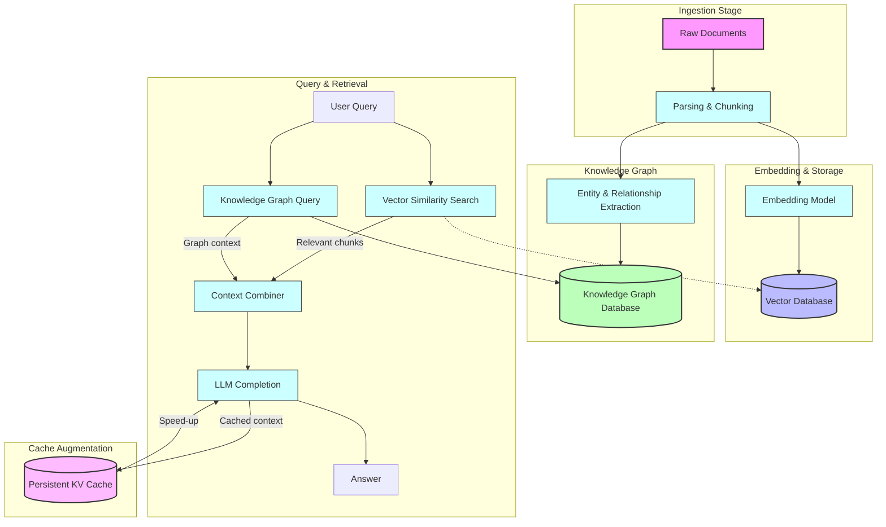

# System Architecture Overview

Explore a clear and concise visual map of Morphik's core architectural components and understand how data flows from ingestion to advanced knowledge graph retrieval.

## Understanding Morphik’s Architecture at a Glance

Morphik orchestrates a seamless end-to-end workflow designed to transform complex, multimodal documents into rich, searchable knowledge structures. This overview shows how data moves through Morphik’s system—from raw input to insightful answers.

### Why This Matters to You

Ingesting visually rich documents such as PDFs with mixed text, images, charts, and tables is inherently complex. Traditional pipelines often fail to preserve this nuance or scale efficiently. Morphik’s architecture is crafted to handle this complexity by integrating multimodal parsing, embedding, vector storage, knowledge graph construction, and caching—under one roof.

This page gives you a high-level perspective, so you can grasp how Morphik turns your documents into intelligent assets quickly and reliably.

---

## Core Components and Data Flow

At the heart of Morphik lies a multi-stage pipeline carefully designed to process, analyze, and retrieve data:

1. **Ingestion:** Documents (PDFs, images, videos, text files) enter Morphik through ingestion interfaces such as the Python SDK or Console. This stage normalizes inputs for downstream processing.

2. **Parsing & Chunking:** Documents are parsed into manageable "chunks" of text and images preserving structural and visual context. Morphik’s parser supports chunking strategies that optimize for downstream embedding relevance.

3. **Embedding:** Each chunk is transformed into vector representations using embedding models. Morphik supports fast multimodal embeddings (e.g., text and images) enabling semantic similarity searches.

4. **Vector Storage:** Embeddings are stored in specialized vector databases (like `pgvector`) for efficient similarity searches. This storage supports rich metadata filtering and multimodal search.

5. **Caching:** Morphik employs persistent key-value caches to augment query generation performance, reducing redundant LLM calls and speeding up response times.

6. **Knowledge Graph Construction:** Leveraging specialized extraction tools, Morphik builds knowledge graphs by identifying entities, relationships, and key facts from document chunks.

7. **Graph Retrieval & Querying:** Users can query the knowledge graph with semantic or structural queries. Responses can incorporate graph context, path navigation, and deep semantic insights.

---

## Visualizing the System Architecture

This diagram encapsulates Morphik’s high-level workflow:

- Documents are parsed into rich chunks that retain semantic and visual cues.
- Embeddings power fast retrieval by semantic similarity from vector stores.
- Simultaneously, entities and relationships are extracted to build a knowledge graph.
- User queries can trigger either vector similarity retrieval or deep graph navigation, or both.
- Relevant content and graph context are combined to feed language models for precise answers.
- Persistent caching accelerates repeated or similar queries, boosting performance.

---

## Key Takeaways for Users

- **Unified Pipeline:** Morphik integrates all critical components—ingestion, parsing, embedding, storage, graph building, and retrieval—in a cohesive system, avoiding fragile external glue code.

- **Multimodal Compatibility:** Treat text, images, and visuals as first-class citizens, preserving essential layout and content context.

- **Scalable Vector Search:** Efficient vector databases accelerate semantic search across massive corpora.

- **Knowledge Graph Intelligence:** Graphs built from your documents enable complex relationship queries impossible with pure text search.

- **Speed & Responsiveness:** Caching mechanisms reduce reliance on repeated costly LLM operations.

---

## How This Fits Into Morphik's Documentation

This overview complements detailed technical guides on ingestion, knowledge graphs, search, and caching. It provides the "big picture" context needed before deep dives into the APIs or SDK usage.

Refer to the following for next steps:

- [Building a Knowledge Graph from Documents](../guides/knowledge-graphs/build-knowledge-graph) — learn how graphs are created.
- [Querying and Visualizing Knowledge Graphs](../guides/knowledge-graphs/query-graph) — see graph querying in action.
- [Multimodal Search & Retrieval](../guides/core-workflows/multimodal-search) — explore how embedding retrieval complements graphs.

---

## Practical Tips

- When designing your document ingestion workflows, plan metadata and folder scopes early; Morphik uses these for filtering and graph scoping.
- Use knowledge graphs to capture connected domain-specific insights, especially when relationships beyond text context matter.
- Leverage vector search for quick retrieval of relevant content pieces before deeper graph exploration.
- Monitor graph processing status and job stages using Morphik’s API or Console to understand background orchestration.

---

By mastering this architectural overview, you’ll better architect your AI application flows with Morphik—harnessing the full power of multimodal data, semantic search, and graph-based knowledge.
