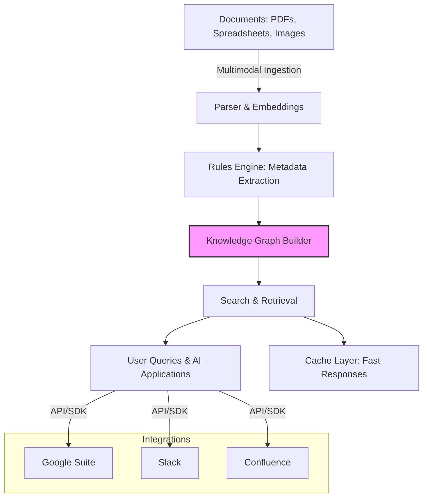

# Feature Highlights: Multimodal, Graphs, Rules & More

Discover how Morphik unlocks the power of complex, multimodal document workflows through advanced features that deliver real-world impact. Each core capability is designed to streamline your data processing, enrich semantic understanding, and integrate seamlessly into your existing environment—empowering smarter searches, faster insights, and richer knowledge graphs.

---

## Unlocking Value with Morphik's Flagship Features

### Multimodal Search and Retrieval

Morphik goes beyond plain text search by embracing multimodal understanding—this means it interprets documents containing text, tables, images, and other visuals together. Imagine searching through a mixture of reports, PDFs, spreadsheets, and presentations with results that respect the visual and semantic context rather than just keyword matches.

**What You Achieve:**
- Precision retrieval across document types
- Context-aware matching even when text is sparse or heavily formatted
- Access answers grounded in the combined textual and visual data

**Practical Example:**
A product manager uploads technical datasheets that include images and tables. Using Morphik’s multimodal search, they quickly find specific product specs across formats without manually parsing varying document structures.

### Fast Knowledge Graph Construction

Morphik automatically extracts entities and their relationships from documents to build knowledge graphs, a structured way to explore complex information networks.

**User Benefits:**
- Visualization of connections for deeper insights
- Enables intuitive queries that leverage relationships between concepts
- Accelerates workflows such as research, compliance checks, and due diligence

**Use Case:**
A legal team loads contracts and notices automatically generated linkages between clauses, parties, deadlines, and obligations. This graph enables rapid compliance audits and contract analysis.

### Rule-Based Metadata Extraction

Beyond raw data ingestion, Morphik uses rules-driven metadata extraction to annotate documents intelligently. You define extraction patterns or leverage built-in templates to pull structured metadata fields out of unstructured content.

**Why It Matters:**
- Extracts relevant attributes automatically with high accuracy
- Supports tailored annotations for your domain and workflow
- Simplifies downstream processing and analytics

**Scenario:**
An academic research group annotates journal papers with experimental parameters and author affiliations using custom extraction rules, facilitating enriched publication databases.

### Seamless Integrations

Morphik fits into your ecosystem through robust integration points—whether it’s connecting to Google Suite, Slack, Confluence, or embedding capabilities in existing applications via REST APIs or the Python SDK.

**What You Gain:**
- Smooth onboarding with familiar platforms
- Flexibility to automate and scale workflows without disruption
- Real-time updates and synchronization across tools

**Example:**
A customer support team links Morphik to Slack channels, enabling agents to query knowledge graphs directly during troubleshooting conversations.

### High-Performance Cache-Augmented Generation

By incorporating advanced caching strategies, Morphik accelerates AI-powered generation and retrieval. Cache-augmented workflows reduce latency and cost by reusing prior results intelligently.

**Advantages:**
- Faster response times for interactive applications
- Significant reduction in repetitive API calls and compute waste
- Improved system scalability and reliability

**Practical Impact:**
A chatbot using Morphik’s cache-augmented generation delivers answers in seconds by reusing cached embeddings and responses, enhancing user experience and throughput.

---

## How These Features Fit Into Your Workflow

From ingestion to answer delivery, Morphik’s features connect seamlessly to solve common challenges faced by data scientists, developers, and product teams:

1. **Ingest documents multimodally** to retain full context and semantics.
2. **Extract metadata and apply business rules** to classify and annotate data.
3. **Build structured knowledge graphs** to reveal hidden relationships.
4. **Search and query with precision** using multimodal embeddings and reranking.
5. **Integrate and automate** via APIs and SDKs for customized workflows.
6. **Leverage caching** to optimize performance and reduce cost.

---

## Tips to Maximize Feature Benefits

- Use the rule engine early in your data pipeline to standardize metadata, making subsequent graph construction and search more effective.
- Incorporate knowledge graphs when your use case depends on understanding relationships, not just isolated facts.
- Enable ColPali and reranking in the search options to improve relevance for complex queries.
- Combine Morphik Console for manual management with SDKs for automation to suit different team workflows.

---

## Troubleshooting and Common Pitfalls

- Ensure document types are fully supported to leverage multimodal capabilities; unsupported file types may default to simple text extraction.
- Rule configuration requires careful testing to avoid missed or incorrect metadata capture—start with small sample sets.
- Large knowledge graphs demand appropriate hardware and timeout settings; consult scaling guidelines when working at enterprise scale.

---

## Visual Summary

---

## Next Steps

To start harnessing these powerful features:
- Try the [Quick Start: Using Morphik](https://docs.morphik.io/overview/feature-overview/quickstart) guide to run your first ingestion and search.
- Explore detailed [Core Workflows](https://docs.morphik.io/guides/core-workflows/) for document ingestion, search, and metadata extraction.
- Dive into [Building Knowledge Graphs](https://docs.morphik.io/guides/knowledge-graphs/build-knowledge-graph) to understand graph creation and queries.
- Visit [Console, Python SDK & API Options](https://docs.morphik.io/overview/feature-overview/console-sdk-api) to find your preferred interface.

Join the Morphik community to share your use cases, or reach out to support if you encounter any challenges.

---

## See Also
- [What is Morphik?](https://docs.morphik.io/overview/intro-value/what-is-morphik)
- [Why Choose Morphik?](https://docs.morphik.io/overview/intro-value/why-morphik)
- [System Architecture Overview](https://docs.morphik.io/overview/architecture-core-concepts/system-architecture)

---