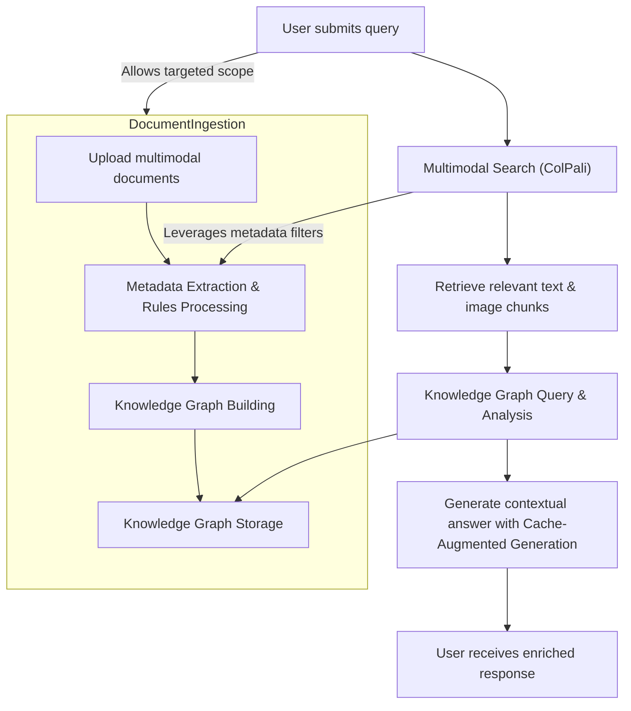

# Key Features at a Glance

Discover Morphik's flagship capabilities designed to empower developers dealing with complex, visually rich, and multimodal data. This overview highlights core features driving accuracy, efficiency, and seamless integration across diverse data types and workflows.

---

## Multimodal Search with ColPali Technology

Unlock the power of truly understanding your documents—not just as text but as rich visual content. Morphik’s ColPali technology delivers a next-generation multimodal search experience by combining semantic understanding of text with visual context from images, tables, and diagrams.

- **Single unified search across text, images, charts, and video frames** enables comprehensive results that retain spatial and visual relationships.
- **Context-aware vector similarity retrieval** uses multi-vector embeddings to capture nuances from mixed media, not just raw text.
- **Scoped search with folder or end-user filtering** lets you target specific collections with rich metadata.

> Imagine querying a complex engineering manual and instantly retrieving critical assembly steps embedded in diagrams alongside explanatory text — all in a seamless, single search.

---

## Lightning-Fast Knowledge Graph Building

Convert your documents into actionable insights with Morphik’s scalable and customizable knowledge graph creation tools.

- **Automated entity extraction and relationship detection** transform unstructured multimodal content into structured domain knowledge.
- **Customizable prompt overrides and domain-specific examples** steer extraction toward your unique terminology.
- **Incremental updates and real-time processing** allow graphs to evolve as new documents enter your system.
- **Query graph for semantic navigation** of entities and relationships beyond keyword search.

Use case example: From a collection of regulatory filings, construct a live graph of companies, key personnel, contracts, and events for instant discovery and compliance checking.

---

## Advanced Metadata Extraction & Rules Engine

Extract fine-grained metadata rapidly to fuel indexing, search filters, and content moderation.

- **Rule-based processors** extract bounding boxes, classifications, timestamps, and labels from rich documents.
- **Support for mixed content types** — text, images, tables, and videos — ensures metadata reflects all aspects of a document’s structure.
- **Real-time processing and caching** optimize throughput and reduce repetitive computation.

Example scenario: Automatically identify and tag product specifications, expiry dates, and ingredient lists from complex multi-page PDFs for regulatory review.

---

## Robust Integrations with Leading Platforms

Morphik fits smoothly into your existing workflows with integration support for popular tools including Google Workspace, Slack, Confluence, and more.

- **Seamless ingestion from cloud storage and collaboration platforms** accelerates document onboarding.
- **Notification and chat integrations** enable conversational querying directly from your favorite communication tools.
- **Extensible SDKs and APIs** empower you to build customized pipelines tailored to your business needs.

This reduces friction in adopting Morphik and extends its power to where your teams work daily.

---

## High-Performance Cache-Augmented Generation

Speed up your AI applications with persistent document caching that avoids redundant processing and cuts infrastructure costs.

- **Persistent KV-caches of document chunks** speed repetitive queries and generation.
- **Tightly integrated with Morphik’s search and graph capabilities** for context-rich, accurate completions.
- **Supports multi-vector embeddings with ColPali** for multimodal generation scenarios.

Benefit from dramatically reduced latency and improved throughput, all while maintaining deep contextual awareness.

---

## How These Features Work Together

Here's a high-level user flow illustrating how Morphik’s key capabilities combine to deliver value:

This workflow demonstrates how developers create an enriched document repository with structured metadata and graphs, enabling powerful multimodal search and conversational AI.

---

## Practical Tips and Best Practices

- **Leverage folders and metadata filtering** to optimize search scope and results relevance.
- **Use domain-specific entity examples** to boost knowledge graph accuracy and reduce false positives.
- **Apply incremental document updates** to keep graphs and caches fresh without reprocessing everything.
- **Combine multimodal extraction with cache-augmented generation** for applications that require both speed and comprehension of visual context.

---

## Getting Started with These Features

Explore hands-on guides and API references to begin leveraging Morphik’s flagship capabilities:

- Visit [Multimodal Search & Retrieval](https://morphik.ai/docs/guides/core-workflows/multimodal-search) for detailed search workflows.
- Build your first knowledge graph with [Building a Knowledge Graph from Documents](https://morphik.ai/docs/guides/knowledge-graphs/build-knowledge-graph).
- Learn how to extract metadata using rules in [Metadata Extraction with Rules Engine](https://morphik.ai/docs/guides/core-workflows/extract-metadata).
- Implement cache-augmented generation to accelerate responses in [Cache-Augmented Generation & Fast Retrieval](https://morphik.ai/docs/guides/integrations-and-caching/cache-augmentation).
- Check the [Console, Python SDK & API Options](https://morphik.ai/docs/overview/feature-overview/console-sdk-api) to choose how to integrate Morphik into your apps.

---

Morphik’s key features empower you to tackle the toughest challenges of complex, visually rich data—making your AI applications smarter, faster, and more reliable.

Start your journey today!

---

For more complete context, visit [What is Morphik?](https://morphik.ai/docs/overview/intro-value/what-is-morphik) and [Why Choose Morphik?](https://morphik.ai/docs/overview/intro-value/why-morphik) to understand the foundational value propositions before exploring these highlights.
