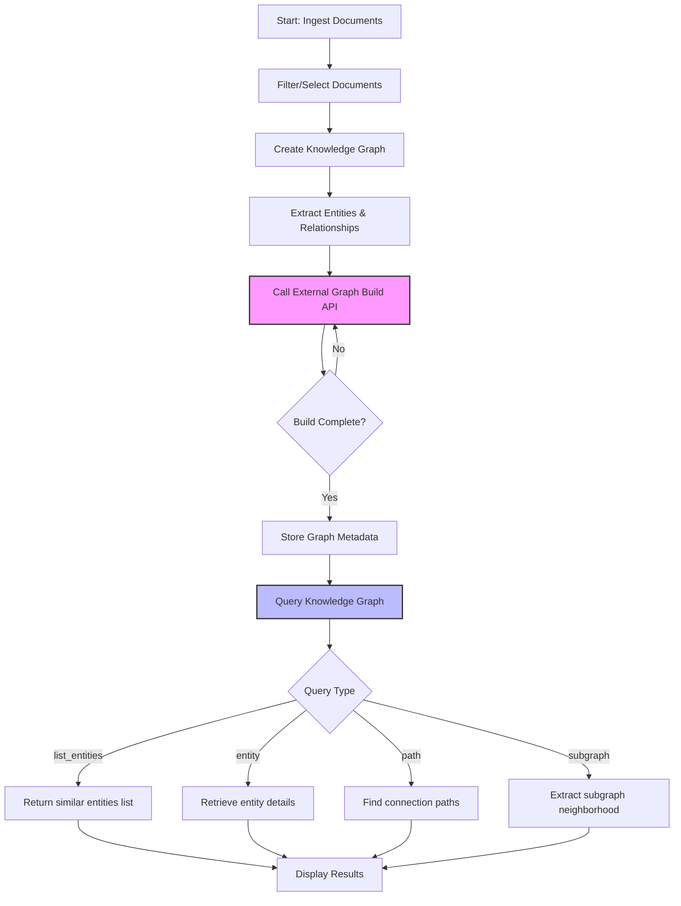

# Building Knowledge Graphs with Morphik SDK

Unlock the full potential of your ingested documents by constructing knowledge graphs that represent entities and their relationships. This guide walks you through creating, populating, and querying knowledge graphs using the Morphik Python SDK. You'll learn how to transform raw document content into structured, connected insights that empower advanced semantic queries and rich contextual exploration.

---

## Understanding Knowledge Graphs in Morphik

A knowledge graph in Morphik captures:
- **Entities:** Core concepts or objects extracted from your documents (e.g., persons, organizations, conditions).
- **Relationships:** Connections between entities, characterizing their associations.
- **Graph Metadata:** Tracking documents, timestamps, and scoping details.

Each graph is a standalone resource linked to specific sets of documents, enabling domain-focused exploration.

### Core Concepts

- **Entity and Relationship Models:** Unique IDs, labels, types, with associated document references and properties.
- **Graph Object:** Aggregates entities and relationships, with metadata for creation and updates.

This structure ensures efficient lookups and traversal when querying your data.

---

## Workflow Overview for Building Knowledge Graphs

1. **Document Preparation:** Ingest and optionally filter documents forming the knowledge base.
2. **Graph Creation:** Build the initial graph from these documents.
3. **Graph Updating:** Add new documents or refresh the graph content.
4. **Querying the Graph:** Perform entity lookups, path finding, subgraph retrieval, and semantic searches.

Each step is customizable with prompt overrides for tailored extraction and resolution.

---

## Step 1: Preparing Your Documents

Before constructing a knowledge graph, ensure you have ingested documents ready for analysis. Use metadata filters or specify exact document IDs to scope graph creation.

```python
from morphik import Morphik
import os

# Initialize Morphik client
client = Morphik(os.getenv("MORPHIK_URI"))

# Example: Metadata filter to select tech domain documents
filters = {"category": "tech"}

# Optionally, list document IDs explicitly
# documents = ["doc_id_1", "doc_id_2"]
```

---

## Step 2: Creating a Knowledge Graph

Create your knowledge graph by specifying a name and providing document filtering or explicit document IDs. This triggers entity and relationship extraction along with graph assembly.

```python
# Create a knowledge graph
graph = await client.create_graph(
    name="tech_healthcare_graph",
    filters=filters,  # or documents=documents
)

print(f"Created graph '{graph.name}' with {len(graph.entities)} entities and {len(graph.relationships)} relationships")
```

### Customizing Graph Creation

You can provide **prompt overrides** to fine-tune entity extraction or resolution to your domain:

```python
from morphik.models import GraphPromptOverrides, EntityExtractionPromptOverride, EntityResolutionPromptOverride, EntityExtractionExample, EntityResolutionExample

overrides = GraphPromptOverrides(
    entity_extraction=EntityExtractionPromptOverride(
        examples=[EntityExtractionExample(label="AI", type="TECHNOLOGY")]
    ),
    entity_resolution=EntityResolutionPromptOverride(
        examples=[EntityResolutionExample(canonical="Artificial Intelligence", variants=["AI"])]
    )
)

graph = await client.create_graph(
    name="custom_tech_graph",
    filters=filters,
    prompt_overrides=overrides
)
```

---

## Step 3: Updating an Existing Graph

Extend or refresh a graph incrementally by adding new documents or filters. Morphik automatically identifies new documents not already included.

```python
# Update graph with new docs matching additional_filters
additional_filters = {"domain": "machine_learning"}
updated_graph = await client.update_graph(
    name="tech_healthcare_graph",
    additional_filters=additional_filters
)

print(f"Updated graph '{updated_graph.name}' now has {len(updated_graph.document_ids)} documents")
```

### Notes:
- The update process calls an external graph API asynchronously for large graphs.
- Graph metadata reflects build/update status.

---

## Step 4: Querying the Knowledge Graph

Once your graph is built, query it to uncover relationships and gain insights beyond raw text search.

### Query Types Supported

- **list_entities:** Find entities semantically related to a search term
- **entity:** Retrieve details for a specific entity ID or label
- **path:** Discover connection paths between two entities
- **subgraph:** Extract a network neighborhood around an entity

### Basic Query Example

```python
response = await client.query(
    "How is AI applied in healthcare?",
    graph_name="tech_healthcare_graph",
    hop_depth=2
)

print(response.completion)
```

### Advanced: Query Graph Paths

```python
paths_json = await client.knowledge_graph_query(
    query_type="path",
    start_nodes=["Artificial Intelligence", "patient outcomes"],
    max_depth=3,
    graph_name="tech_healthcare_graph"
)

import json
paths = json.loads(paths_json)
print("Paths found:")
for p in paths["paths"]:
    print(" -> ".join(p))
```

---

## Practical Example: End-to-End Knowledge Graph Workflow

```python
import os
from morphik import Morphik

async def main():
    # Initialize client
    client = Morphik(os.getenv("MORPHIK_URI"))

    # Ingest documents (assumed done beforehand)

    # Create graph
    filters = {"category": "tech"}
    graph = await client.create_graph(name="tech_healthcare_graph", filters=filters)

    print(f"Graph '{graph.name}' created.")

    # Query graph
    query_text = "How is AI technology being used in healthcare?"
    response = await client.query(query_text, graph_name=graph.name, hop_depth=2)
    print("Graph query response:\n", response.completion)

if __name__ == "__main__":
    import asyncio
    asyncio.run(main())
```

---

## Troubleshooting and Tips

- **No Graphs Found:** Ensure documents are ingested and filters/data are correctly specified before graph creation.
- **Long Delays on Large Graphs:** Graph building and updating are asynchronous processes; monitor workflow status if available.
- **Query Returns No Paths:** Try increasing `hop_depth` or verify entity labels/IDs.
- **Prompt Overrides Not Taking Effect:** Confirm prompt override objects are correctly constructed and passed.

---

## Additional Capabilities

- **Graph Visualization:** Use the visualization API to generate graph-renderable data for rich UIs.
- **Graph API Retrieval:** For remote (API-backed) Morphik setups, use `graph_api_retrieve` for querying knowledge graphs.
- **Combined RAG Queries:** Generate answers using combined retrieval from graphs and document chunks for enhanced context.

---

## Related Documentation

- [Querying and Visualizing Knowledge Graphs](https://docs.morphik.ai/guides/knowledge-graphs/query-graph)
- [Advanced: Customizing Graph Extraction and Prompts](https://docs.morphik.ai/guides/knowledge-graphs/advanced-graph-operations)
- [Ingesting Documents of All Types](https://docs.morphik.ai/guides/core-workflows/ingest-documents)
- [Multimodal Search & Retrieval](https://docs.morphik.ai/guides/core-workflows/multimodal-search)
- [SDK Usage & Code Examples](https://docs.morphik.ai/api-reference/api-authentication-requests/sdk-examples)

---

## Summary Diagram: Knowledge Graph Build and Query Flow



---

# Summary

Building knowledge graphs with the Morphik SDK enables you to transform ingested documents into structured, interconnected graphs of entities and relationships. This page guides you through document selection, graph creation, updating with new data, and powerful query techniques that unlock domain-specific answers and path explorations.

By following this step-by-step guide, you can leverage customizable prompt overrides and integrate graph querying seamlessly into your workflows. Practical examples demonstrate both creation and querying, with tips to troubleshoot common issues.

Explore related guides for advanced graph customization, visualization, multimodal search, and SDK usage examples to deepen your expertise and maximize the value of Morphik's AI-native knowledge graph capabilities.
