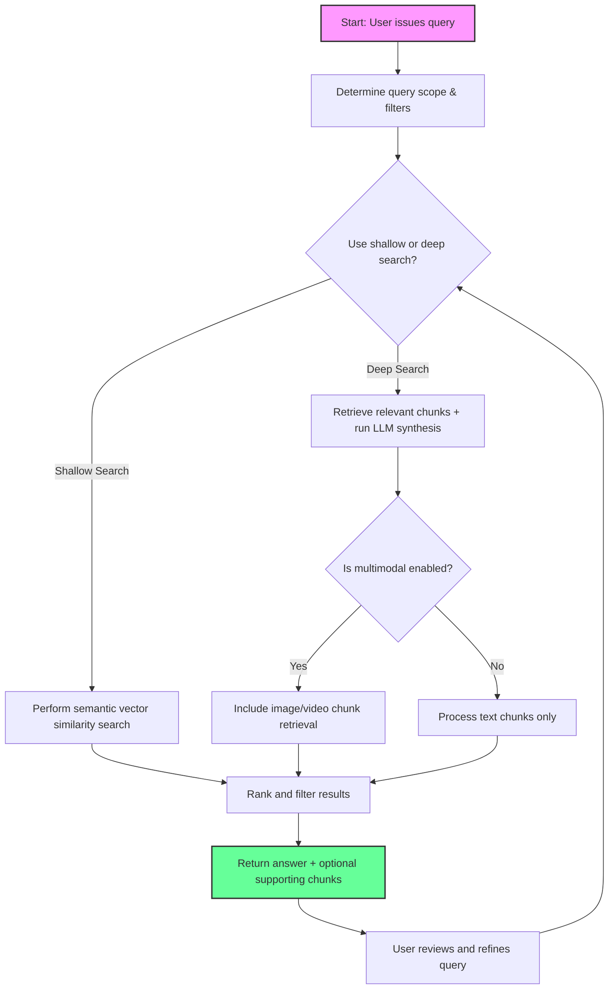

# Search & Query Documents

Unlock the full potential of your ingested multimodal documents by harnessing the Morphik SDK's powerful search and query capabilities. This guide walks you through how to effectively retrieve information using deep and shallow search patterns, leverage multimodal query support (spanning text, images, and videos), and adopt best practices designed to maximize the relevance and precision of your results.

---

## Why Query Your Multimodal Document Collection?

Morphik is built to handle complex documents that combine text, images, and other modalities. Querying such multimodal content requires specialized approaches beyond simple keyword search. Using the SDK, you can seamlessly ask natural language questions, retrieve contextually relevant fragments, and get precise answers from your documents — whether searching deeply for detailed insights or shallowly for quick summaries.

This page empowers developers and data scientists to achieve these outcomes by presenting practical methods, real-use scenarios, and strategic advice.

---

## Understanding Search Patterns in Morphik SDK

Morphik supports multiple search strategies with varying depth and complexity. Understanding these patterns helps you choose the right approach for your needs:

### 1. Shallow Search (Keyword and Basic Semantic Retrieval)
- **Use Case:** Quick retrieval of relevant document chunks based on direct semantic similarity.
- **How it works:** Queries are embedded to a vector space, matched against chunk embeddings in your knowledge base, and top matches returned.
- **Example:** Finding mentions of "AI applications in healthcare" and returning the most relevant paragraphs.

### 2. Deep Search (Contextual and Synthesized Answers)
- **Use Case:** Extracting precise answers that require interpreting multiple chunks or documents.
- **How it works:** Combines retrieval with language models to synthesize answers from multiple content fragments.
- **Example:** Answering "What types of AI models are used for patient outcome prediction?" by synthesizing data from various technical sections.

---

## Multimodal Queries: Beyond Text

Your documents may include images, diagrams, or videos. Morphik’s SDK supports queries that recognize and retrieve across these modalities:

- **Image & Diagram Search:** Match query semantics to image captions, OCR-extracted text, or embedded visual features.
- **Video Frame Search:** Retrieve relevant frames or captions in video documents.

This capability ensures your search retrieves relevant information regardless of whether it's embedded in text or visuals.

---

## Getting Started: Simple Query Example with Morphik Python SDK

Here's a minimal example demonstrating querying your documents for answers:

```python
from morphik import Morphik
import os

# Initialize Morphik client
client = Morphik(os.getenv("MORPHIK_URI"), timeout=10000, is_local=True)

# Simple natural language query
query_text = "What are the different types of artificial intelligence?"

# Execute query
response = client.query(query_text)

# Print the answer
print("Answer:", response.completion)
```

This basic snippet executes a shallow semantic search over all ingested documents accessible to your account.

---

## Advanced Usage: Deep and Multimodal Search Patterns

To leverage advanced multimodal querying and deep search patterns, you can customize your query parameters:

```python
response = client.query(
    question="Explain reinforcement learning in AI.",
    max_tokens=500,
    temperature=0.5,
    include_document_chunks=True,  # Returns relevant chunks alongside answer
    multimodal=True,               # Enables image/video context search
    filters={"category": "technology"},  # Restricts search scope
)
print(response.completion)
```

### Key Parameters:
- `question`: Your natural language query.
- `max_tokens`: Control length of answer.
- `temperature`: Adjusts creativity/randomness in generated text.
- `include_document_chunks`: Retrieve supporting document fragments.
- `multimodal`: Enables searching across text and non-text modalities.
- `filters`: Narrow results by metadata such as category, date, or author.

---

## Best Practices for Effective Searches

### 1. Scope Your Queries
- Always use filters and folders to narrow search space when dealing with large corpora.
- This improves relevance and reduces response latency.

### 2. Use Multimodal Queries when Visual Evidence Matters
- Enable `multimodal=True` to include images and videos in search.

### 3. Customize Token Limits Thoughtfully
- Balance answer comprehensiveness and cost by tuning `max_tokens`.

### 4. Include Context When Necessary
- Setting `include_document_chunks=True` will return text/image chunks supporting answers, aiding transparency and traceability.

### 5. Combine Queries with Knowledge Graphs for Complex Insights
- Synthesize information from multiple sources with knowledge graph queries (see guides on [Querying Knowledge Graphs](/guides/knowledge-graphs/query-graph)).

---

## Step-by-Step Workflow for Querying Documents

<Steps>
<Step title="Step 1: Ingest Documents">
Ensure your documents are ingested into Morphik with proper metadata and folder scoping.
</Step>
<Step title="Step 2: Prepare Your Query">
Formulate your natural language question or keyword search.
</Step>
<Step title="Step 3: Execute a Search via the SDK">
Use the `query()` method on the Morphik client. Adjust parameters to tailor depth and modality.
</Step>
<Step title="Step 4: Review the Output">
Analyze the returned answer and any supporting chunks or documents.
</Step>
<Step title="Step 5: Refine the Query as Needed">
Use filters, change parameters, or incorporate graph queries to improve results.
</Step>
</Steps>

---

## Common Pitfalls and Troubleshooting

<AccordionGroup title="Troubleshooting Search Issues">
<Accordion title="Low Relevance Results">
If your queries return unrelated or sparse results:
- Check and refine your filters and folder scoping.
- Increase the number of retrieved chunks.
- Verify document ingestion completeness.
- Enable reranking if available (e.g., `use_reranker` in config).
</Accordion>
<Accordion title="Missing Visual Content in Results">
- Confirm that vision-enabled models are configured correctly.
- Use `multimodal=True` in queries.
- Ensure that documents with images/videos were properly ingested and parsed.
</Accordion>
<Accordion title="Timeouts or Slow Responses">
- Reduce `max_tokens` or complexity.
- Narrow search scope with metadata filters.
- Avoid retrieving large numbers of document chunks unless necessary.
- Increase client or server timeout if feasible.
</Accordion>
<Accordion title="Authentication or Permission Errors">
- Verify your API token and permissions allow read access to targeted documents.
- Check user scoping and folder permissions.
- Consult the [Authentication Overview](/api-reference/api-authentication-requests/auth-overview).
</Accordion>
</AccordionGroup>

---

## Related Examples and Resources

- **Cache-Augmented Generation:** Speed up queries with prebuilt caches ([Cache Augmented Generation Guide](/guides/integrations-and-caching/cache-augmentation), example code in [cache_augmented_generation.py](examples/cache_augmented_generation.py))
- **Multimodal Search Workflow:** Deep dive into multimodal search usage ([Multimodal Search & Retrieval Guide](/guides/core-workflows/multimodal-search))
- **Knowledge Graph Querying:** Combine graph insights with document search ([Querying and Visualizing Knowledge Graphs](/guides/knowledge-graphs/query-graph), example code in [knowledge_graphs.py](examples/knowledge_graphs.py))
- **SDK Code Samples:** Comprehensive SDK usage examples in the SDK documentation and GitHub repository.

---

## Visual Workflow Diagram of Querying Documents



---

## Summary

Morphik SDK empowers you to perform fast, relevant queries over complex multimodal document collections. By combining deep and shallow search strategies with multimodal support and flexible filtering, you can retrieve precise answers alongside supporting content. Follow the stepwise examples, adopt best practices, and utilize related knowledge graph and cache features to get the most from your intelligent search workflows.

---