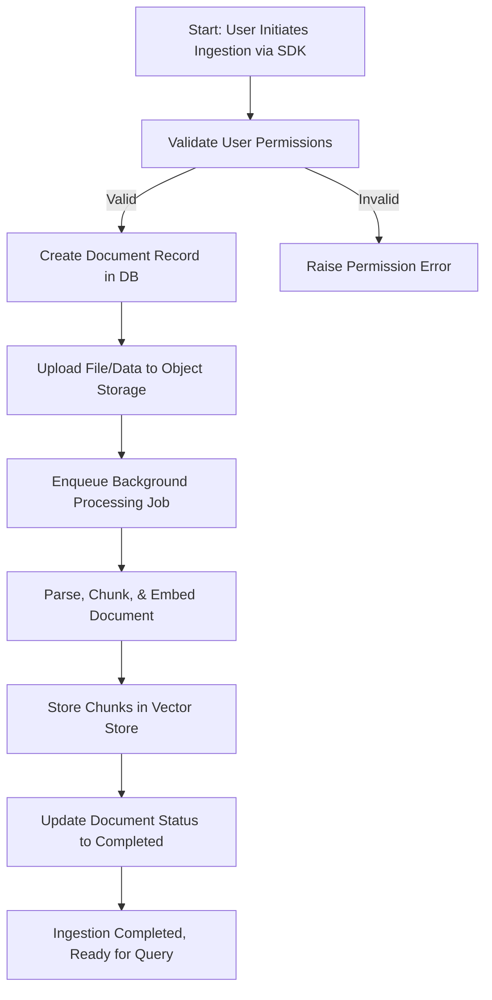

# First Data Ingestion with the Morphik Python SDK

Welcome to your first step in unlocking the power of Morphik! This guide shows you how to ingest your initial file or dataset using the Morphik Python SDK. By following along, you'll discover how simple it is to onboard diverse document formats, including PDFs, images, and videos, into Morphik’s unified AI-native platform.

---

## Why Start With Data Ingestion?
Think of Morphik as an intelligent data vault. Before you can query or analyze, you need to bring your data in—be it plain text documents, scanned PDFs, image collections, or video files. Ingesting your data correctly ensures that Morphik will understand and index it efficiently, enabling rich search, metadata extraction, multimodal retrieval, and downstream knowledge graph building.

This guide leads you through that crucial first step, empowering you with practical knowledge, example usage, and tips to avoid common pitfalls.

---

## Supported Formats

Morphik’s ingestion pipeline accepts a broad range of document types:

- **Plain Text:** `.txt` files or simple strings
- **PDFs:** Multipage documents with embedded images and text
- **Images:** JPEG, PNG, and other common formats
- **Office Documents:** Word files (`.docx`, `.doc`) are internally converted to PDF for ingestion
- **Videos:** (Supported via appropriate connectors and upcoming features)

Your files will be automatically chunked, embedded, and indexed regardless of format, providing a seamless ingestion experience.

---

## Prerequisites

Before you begin, ensure that:

- You have installed the Morphik Python SDK. See [Installing the SDK](https://docs.morphik.ai/sdks/getting-started/install-sdk).
- You have access to a running Morphik instance with a valid URI token.
- You have Python 3.8+ installed.
- Your environment variables (e.g., `MORPHIK_URI`) are set appropriately.

---

## Getting Started: Basic Setup

Install the SDK if you haven't already:

```bash
pip install morphik
```

Load your environment variables and initialize the Morphik client:

```python
import os
from dotenv import load_dotenv
from morphik import Morphik

load_dotenv()  # Loads MORPHIK_URI from .env file

db = Morphik(os.getenv("MORPHIK_URI"))
```

---

## Ingesting a Plain Text Document

The simplest form of ingestion is a raw string of text:

```python
text_content = "Morphik is an AI-native platform for working with multimodal documents."

doc = db.ingest_text(text_content, metadata={"category": "overview", "source": "demo"})
print(f"Ingested text document with ID: {doc.external_id}")
```

### What Happens Next?
- Morphik splits your text into smaller chunks suitable for embedding.
- Each chunk is embedded, indexed, and stored.
- Metadata tags you provide are attached to help filtering and retrieval.

---

## Ingesting a File (PDF or Image)

You can ingest local files such as PDFs or images. Here's how to ingest a PDF file:

```python
file_doc = db.ingest_file("path/to/your/document.pdf", metadata={"category": "reports"})
print(f"Ingested file document with ID: {file_doc.external_id}")
```

For image files (JPEG, PNG):

```python
image_doc = db.ingest_file("path/to/image.png", metadata={"category": "images"})
print(f"Ingested image with ID: {image_doc.external_id}")
```

**Internally**, Word documents are converted to PDFs to facilitate ingestion.

---

## Handling Large Documents and Multimodal Data

Morphik automatically breaks down large documents into chunks and supports multimodal embeddings (text, image, and more) through integrated models like ColPali.

To enhance ingestion with multimodal features, enable multi-vector processing:

```python
multimodal_doc = db.ingest_file(
    "path/to/multimodal_file.pdf",
    metadata={"category": "research"},
    use_colpali=True  # Enables multimodal vector embeddings
)
print(f"Ingested multimodal document with ID: {multimodal_doc.external_id}")
```

---

## Tips for Successful Ingestion

- **Metadata Matters:** Proper metadata improves downstream filtering and graph building.
- **Folder and User Scoping:** Organize documents into folders or assign to users to scope access and retrieval.
- **Rules for Extraction:** Use ingestion-time rules to extract structured metadata or apply transformations automatically ([see Metadata Extraction guide](https://docs.morphik.ai/guides/core-workflows/extract-metadata)).
- **File Size:** Make sure files are within your Morphik instance limits; chunking will happen automatically.
- **Multiple Files:** Use batch methods to ingest multiple documents at once with shared or individual metadata.

---

## Example: Full Roundtrip - Ingest and Query

```python
from morphik import Morphik
import os
from dotenv import load_dotenv

load_dotenv()

db = Morphik(os.getenv("MORPHIK_URI"))

# Ingest a document
long_doc = """
Artificial Intelligence (AI) covers many techniques involving machine learning and data processing.
"""

print("Ingesting document...")
doc = db.ingest_text(long_doc, metadata={"category": "technology", "topic": "AI"})
print(f"Ingested document with ID: {doc.external_id}")

# Run a simple keyword query
response = db.query("What is AI?", k=2, temperature=0.7)
print("Query response:")
print(response.completion)
```

---

## Common Pitfalls & Troubleshooting

- **Empty or Corrupt Files:** Ensure your files are not empty and are correctly formatted.
- **Permission Errors:** Make sure your Morphik URI includes the necessary write permissions.
- **Slow Processing:** Large documents or heavy multimodal content may require additional processing time.
- **Unsupported Formats:** Use PDF or image formats primarily; office docs like Word are supported via conversion but may fail if dependencies like LibreOffice are missing.

If ingestion fails or a document status becomes `failed`, check logs for detailed errors.

---

## Next Steps

After successfully ingesting your first documents, proceed to:

- Explore [searching and querying your documents](https://docs.morphik.ai/sdks/core-workflows/search-query)
- Build [knowledge graphs from your data](https://docs.morphik.ai/sdks/core-workflows/knowledge-graphs)
- Apply [metadata extraction rules](https://docs.morphik.ai/guides/core-workflows/extract-metadata)
- Experiment with [cache-augmented generation](https://docs.morphik.ai/guides/integrations-and-caching/cache-augmentation)

---

## Additional Resources

- [Morphik Python SDK Reference](https://docs.morphik.ai/sdks/getting-started/install-sdk)
- [Ingesting Documents Guide](https://docs.morphik.ai/guides/core-workflows/ingest-documents)
- [Multimodal Search](https://docs.morphik.ai/guides/core-workflows/multimodal-search)
- [Best Practices & Troubleshooting](https://docs.morphik.ai/getting-started/troubleshooting-help/common-install-issues)

---

## Mermaid Diagram: Typical Ingestion Flow



---

## Code Snippet: Complete Minimal Ingestion Example

```python
import os
from dotenv import load_dotenv
from morphik import Morphik

load_dotenv()

db = Morphik(os.getenv("MORPHIK_URI"))

# Ingest text
doc = db.ingest_text(
    "Welcome to Morphik. This is your first ingested document.",
    metadata={"purpose": "demo"}
)
print(f"Ingested document ID: {doc.external_id}")

# Ingest a PDF file
file_doc = db.ingest_file("./path/to/file.pdf", metadata={"type": "pdf"})
print(f"Ingested file document ID: {file_doc.external_id}")
```

---

You've successfully taken your first ingestion steps with Morphik! Harness these foundations to build powerful, multimodal AI applications.


